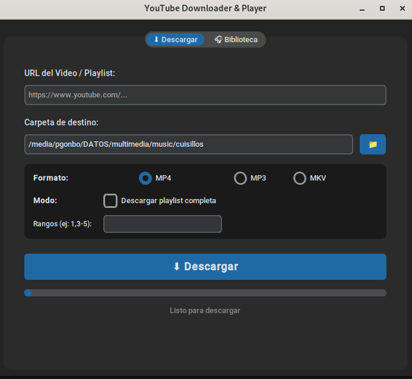
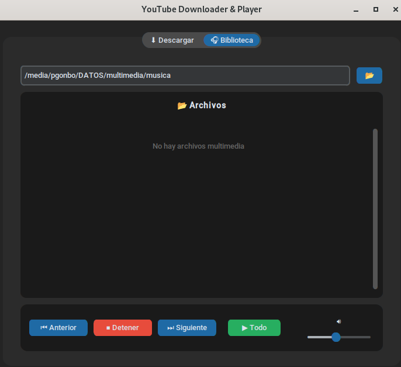

# 🎬 YouTube Downloader & Player

> Tu centro multimedia personal para YouTube. Descarga, convierte y reproduce contenido sin salir de la aplicación.  
> Diseñado para Linux, optimizado para velocidad y simplicidad.


---

## ✨ Características

| Función | Descripción |
|--------|-------------|
| ⬇️ **Descarga Inteligente** | Soporte para videos, audio (MP3) y playlists completas con selector de rangos |
| 🎧 **Reproductor Integrado** | Control de volumen, reproducción continua y navegación `⏮ ⏭` en tiempo real |
| 📁 **Biblioteca Persistente** | Recuerda tu última carpeta y escanea automáticamente archivos multimedia |
| ⚡ **FFmpeg Incluido** | Conversión y encoding optimizado sin instalar dependencias pesadas |
| 🐧 **Linux First** | Compatible con X11/Wayland, PulseAudio/PipeWire y gestores de paquetes modernos |
| 🎨 **UI Moderna** | Interfaz limpia con `CustomTkinter`, tema oscuro nativo y diseño responsive |

---

## 📸 Capturas

<div align="center">
  
  
</div>

*(Reemplaza las rutas con tus propias capturas)*

---

## 🚀 Inicio Rápido

### 1. Clonar el repositorio
```bash
git clone https://github.com/FranciscoGB03/descargador.git
cd downloader/linux
```
### 2. Instalar dependencias
Puedes crear un ambiente virtual: [AMBIENTE_VIRTUAL](INSTALL.md)
```bash
pip3 install -r requirements.txt
```

### 3. Ejecutar
```bash
python3 main.py
```

> ✅ La app se abrirá con el tema oscuro activado y lista para descargar.

---

## 📖 Uso Básico

### ⬇️ Pestaña Descargar
1. Pega la URL de YouTube (video o playlist)
2. Selecciona formato: `MP4`, `MP3` o `MKV`
3. Elige carpeta de destino (se guarda automáticamente para futuras sesiones)
4. Activa `Descargar playlist completa` y define rangos si es necesario
5. Haz clic en `⬇️ Descargar` y observa el progreso en tiempo real

### 🎧 Pestaña Biblioteca
1. Selecciona una carpeta con archivos multimedia
2. La app escaneará y listará automáticamente `.mp3`, `.mp4`, `.mkv`, `.flac`, etc.
3. Usa los controles:
   - `⏮ / ⏭` → Navegar entre pistas
   - `▶️ Todo` → Reproducir lista completa en orden
   - `🔊 Slider` → Ajustar volumen del sistema en tiempo real
   - `⏹ Detener` → Parar reproducción inmediatamente

---

## 📦 Compilar Ejecutable (Standalone)

Genera un binario portable que **no requiere Python instalado**:

```bash
# 1. Instalar PyInstaller
pip3 install pyinstaller

# 2. Ejecutar script de compilación
python3 build_linux.py

# 3. El ejecutable estará en:
./dist/YouTubeDownloader
```

> 📌 El ejecutable incluye `ffmpeg` y `ffprobe`. Solo requiere `ffplay` en el sistema para reproducción (ver requisitos).

---

## 🗂️ Estructura del Proyecto

```
youtube-downloader/
├── main.py                 # Punto de entrada
├── requirements.txt        # Dependencias Python
├── build_linux.py          # Script de compilación PyInstaller
├── REQUISITOS_FFMPEG.md    # Guía completa de instalación de ffplay
├── core/
│   ├── downloader.py       # Lógica de descarga con yt-dlp
│   ├── player.py           # Motor de reproducción con ffplay
│   ├── library.py          # Escáner de biblioteca local
│   └── utils.py            # Detección cross-platform de binarios
├── ui/
│   └── main_window.py      # Interfaz con CustomTkinter
├── bin/
│   └── linux/              # FFmpeg/FFprobe empaquetados
└── scripts/
    ├── download_ffmpeg.py  # Descargador automático de binarios
    └── check_requirements.sh # Verificador de dependencias
```

---

## ⚠️ Requisitos Importantes

| Componente | Estado | Notas |
|-----------|--------|-------|
| `python3` (≥3.10) | ✅ Requerido | Incluido en repositorios oficiales |
| `tkinter` | ✅ Requerido | `sudo apt install python3-tk` |
| `ffmpeg` / `ffprobe` | ✅ **Incluido** | Empaquetado en `bin/linux/` (~150MB) |
| `ffplay` | ⚠️ **Sistema** | Necesario para reproducción. Guía completa: [REQUISITOS_FFMPEG.md](FFPLAY.md) |

> 💡 Si solo usas la app para descargar/convertir, **no necesitas instalar nada extra**. `ffplay` solo es requerido para la pestaña Biblioteca.

---

## 🛠️ Solución Rápida de Problemas

| Síntoma | Solución |
|--------|----------|
| `No module named 'customtkinter'` | `pip3 install -r requirements.txt` |
| Ventana en blanco / no abre | Ejecuta con `python3 -u main.py` y revisa la consola |
| `ffplay: command not found` | Sigue [REQUISITOS_FFMPEG.md](FFPLAY.md) |
| Video sin imagen en Wayland | Ejecuta: `export SDL_VIDEODRIVER=x11` antes de abrir la app |
| Procesos `ffplay` zombies | La app los limpia automáticamente al cerrar. Si persisten: `pkill -9 ffplay` |

---

## 🤝 Contribuir

Las contribuciones son bienvenidas. Para colaborar:

1. Haz fork del repositorio
2. Crea una rama: `git checkout -b feature/nueva-funcion`
3. Realiza tus cambios y haz commit: `git commit -m 'feat: descripción clara'`
4. Push a la rama: `git push origin feature/nueva-funcion`
5. Abre un Pull Request

> 📝 Sigue el estilo PEP8 y añade comentarios donde sea necesario.

---

## 📄 Licencia

Este proyecto está bajo la licencia **MIT**. Puedes usarlo, modificarlo y distribuirlo libremente.  
Ver [LICENSE](LICENSE) para más detalles.

---

## 🙏 Agradecimientos

- [`yt-dlp`](https://github.com/yt-dlp/yt-dlp) → Motor de descarga robusto y actualizado
- [`CustomTkinter`](https://github.com/TomSchimansky/CustomTkinter) → UI moderna y nativa
- [`FFmpeg`](https://ffmpeg.org/) → Suite multimedia estándar de la industria
- Comunidad Linux → Por mantener el ecosistema abierto y accesible

---

<div align="center">
  <sub>Hecho con ❤️ y ☕ para la comunidad Linux</sub>
</div>